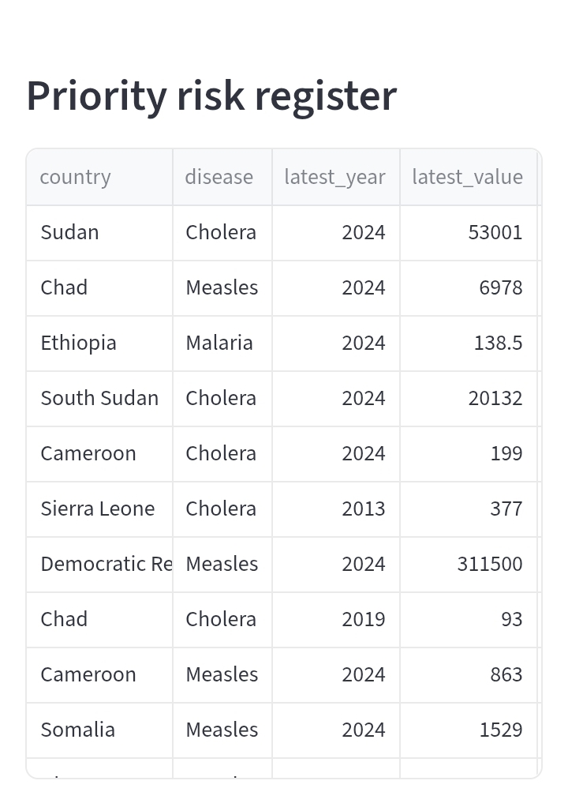
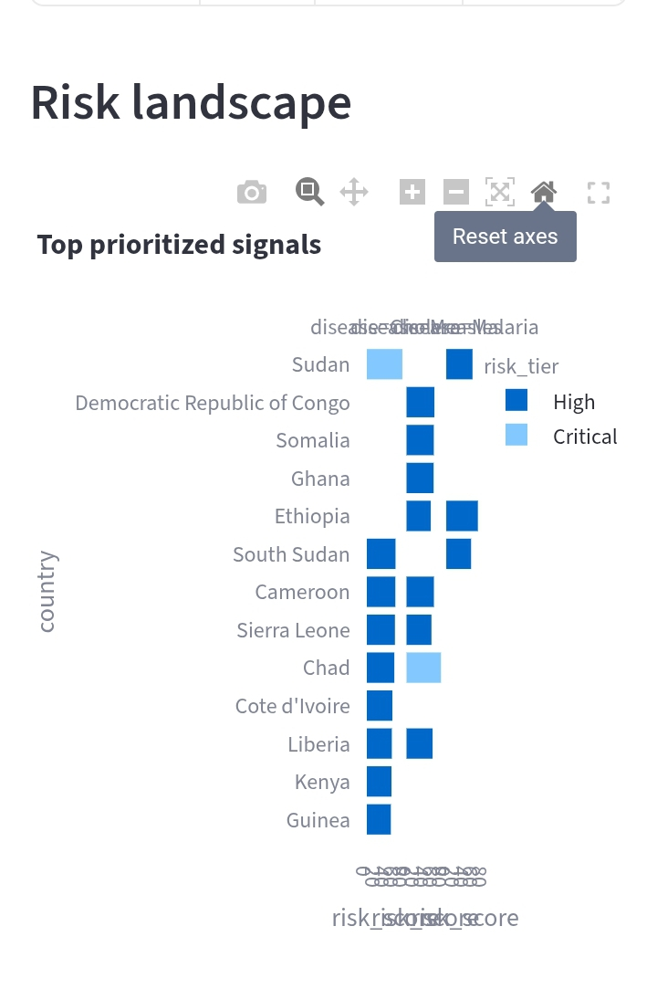
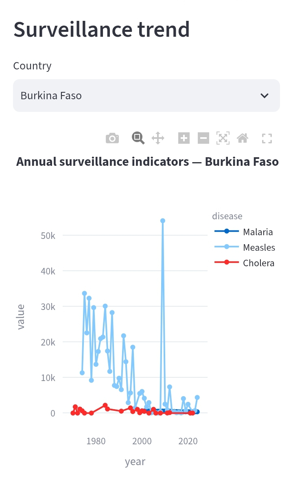
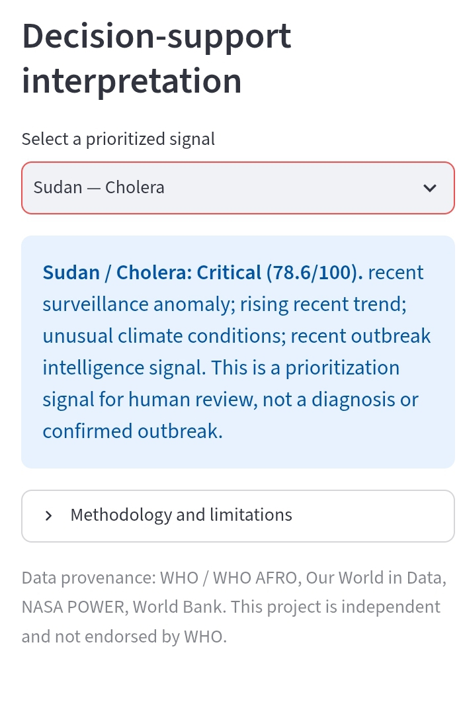

# Africa Public Health Intelligence

**A disease-surveillance analytics pipeline and dashboard that turns messy public health data into a ranked, explainable shortlist of country–disease combinations worth a closer look.**

[](https://public-health-early-warning.streamlit.app/)
[](https://github.com/evanskips2727-del/Africa-Public-Health-Intelligence-/actions)
[](LICENSE)

**Python · Pandas · Streamlit · Plotly · Pytest · GitHub Actions**


> The live app runs on free Streamlit hosting and may need ~30 seconds to wake up. The GIF above shows the full flow.

---

## Key results

From the latest pipeline run:

- **63 country–disease signals** scored across **cholera, measles and malaria**, using four public sources (Our World in Data, WHO Disease Outbreak News, NASA POWER, World Bank).
- **2 Critical and 24 High** signals, so about 4 in 10 scored pairs are flagged for review, and the Critical tier is deliberately narrow.
- **Top signal: Sudan, cholera, 78.6 / 100 (Critical).** It is driven by a recent surveillance anomaly, a rising trend, unusual climate conditions and a recent WHO outbreak signal.
- **Kenya, cholera, scores 54.5 (High).** It is driven by a rising trend, an upward forecast and an outbreak signal, with no anomaly flag.
- Some series reach back to the 1970s, which gives the anomaly and trend logic a long history to work with.

<!-- TODO: add two more numbers if you have them: number of countries covered, number of WHO event records ingested -->

Every score comes with the reasons behind it, so an analyst can see *why* a pair ranked high instead of trusting a black box.

## Screenshots

| Priority risk register | Risk landscape |
|---|---|
|  |  |

| Surveillance trend | Explainable interpretation |
|---|---|
|  |  |

## What it does

1. **Ingests** four public sources and standardizes them into one schema.
2. **Validates** the data (schema checks, missing values, freshness).
3. **Detects anomalies** in disease observations using a rolling median and MAD.
4. **Builds a baseline forecast** (median of the last three annual values).
5. **Scores risk** by combining six signals into one 0–100 composite.
6. **Serves everything** through an interactive Streamlit dashboard.

```
Public sources (OWID, WHO DON, NASA POWER, World Bank)
        │
        ▼
Ingestion  →  Validation  →  Transformation
        │
        ├── Disease trends  → Anomaly detection (rolling median + MAD)
        ├── Climate context → Climate anomalies
        └── Outbreak news   → Keyword event signals
        │
        ▼
Baseline forecast  →  Risk engine  →  data/processed/*.csv  →  Streamlit app
```

## Design decisions

- **MAD instead of mean and standard deviation.** Outbreaks are outliers by definition. With a mean/SD approach, one big spike inflates the spread and hides the next one. Median and MAD stay stable.
  *Parameters:* window = `[X]` years, threshold = `[X]` (modified z-score). <!-- TODO: fill in from src/pipeline.py -->
- **A simple median baseline instead of ARIMA or ML.** The series are short, annual and patchy. A three-year median is easy to explain, hard to overfit, and sets a benchmark any later model must beat.
- **Weights renormalize when a signal is missing.** Many countries lack some indicators. Rather than dropping them or imputing values, the engine scores with the signals that exist and rescales the weights, so each score reflects only real evidence.
- **Explainability over accuracy claims.** The output is a prioritization list for a human analyst, never an outbreak declaration. Each result states this in plain language.

## Risk scoring

| Component | Weight | What it captures |
|---|---|---|
| Disease anomaly | 30% | Unusual recent observations |
| Disease trend | 20% | Direction of historical change |
| Forecast direction | 15% | Baseline forecast vs. latest value |
| Vaccination gap | 15% | Measles coverage shortfall |
| Climate signal | 10% | Temperature and precipitation anomalies |
| Outbreak-event signal | 10% | Keyword matches in WHO outbreak news |

| Score | Tier |
|---|---|
| 0–24 | Low |
| 25–49 | Moderate |
| 50–74 | High |
| 75–100 | Critical |

The weights and thresholds are design choices, not calibrated values.

## Quickstart

```bash
git clone https://github.com/evanskips2727-del/Africa-Public-Health-Intelligence-.git
cd Africa-Public-Health-Intelligence-
python -m venv .venv && source .venv/bin/activate   # Windows: .\.venv\Scripts\Activate.ps1
pip install -r requirements.txt pytest
python scripts/download_data.py && python -m src.pipeline
streamlit run app.py
```

Run the tests with `python -m pytest -q`.

## Outputs

All outputs are written to `data/processed/`:

| File | Contents |
|---|---|
| `disease_surveillance.csv` | Cleaned disease observations |
| `forecasts.csv` | Baseline forecasts |
| `climate_monthly_clean.csv`, `climate_anomalies.csv` | Climate series and anomalies |
| `event_signals.csv` | Signals extracted from WHO outbreak news |
| `risk_register.csv` | Final country–disease risk scores |

## Repository structure

```
├── .github/workflows/ci.yml   # CI: install, run tests
├── config/countries.csv       # Country list and coordinates
├── data/{raw,processed}/
├── docs/                      # Case study and images
├── scripts/download_data.py   # Data acquisition
├── src/pipeline.py            # Main pipeline
├── src/risk_engine.py         # Scoring logic
├── tests/test_risk.py
├── app.py                     # Streamlit dashboard
└── Africa_Public_Health_Intelligence.ipynb
```

## Limitations

This is a portfolio prototype, not an operational surveillance system.

- Scores, tiers and the forecast baseline are **not validated** against verified outbreak outcomes. A high score is not a probability of an outbreak.
- Data is annual and country-level, so it can hide fast or local outbreaks. Missing data does not mean no disease.
- Some country–disease pairs rely on old observations, so check the `latest_year` column before reading a score.
- Event extraction is keyword-based and produces false positives and misses.
- Climate signals are context, not causation.
- Our World in Data republishes figures from other bodies such as WHO, so check the original provider before relying on a number.
- Independent project, not affiliated with or endorsed by WHO or WHO/AFRO.

## Roadmap

- [ ] Backtest the forecast against a naive last-value baseline (report MAE)
- [ ] Evaluate anomaly detection against documented outbreaks
- [ ] Sensitivity analysis on risk weights
- [ ] Tests for the pipeline and anomaly logic
- [ ] Stale-data penalty in the scoring
- [ ] Higher-frequency and subnational data
- [ ] Scheduled pipeline runs

## Author

**Evans Kiplangat** · Data Analyst / Applied Statistician · Nairobi, Kenya
[GitHub](https://github.com/evans25575) · [LinkedIn](https://linkedin.com/in/evans-kiplangat-375646179) · [Portfolio](https://evans25575.github.io/Evans---portfolio-/)

## License

MIT. See [LICENSE](LICENSE).
