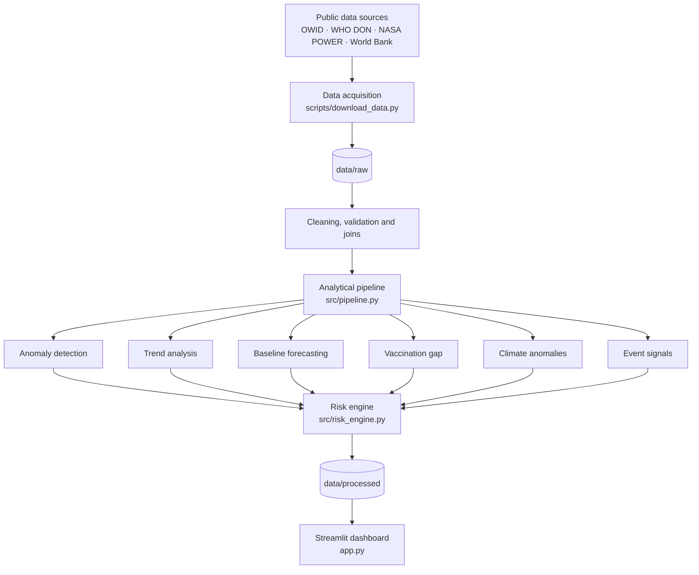

<div align="center">

# Africa Public Health Intelligence Platform

**An explainable disease surveillance and risk-prioritization platform for Africa, built on open public data.**

[](https://www.python.org/)
[](https://public-health-early-warning.streamlit.app/)(https://github.com/evanskips2727-del/Africa-Public-Health-Intelligence/actions/workflows/ci.yml/badge.svg)](https://github.com/evanskips2727-del/Africa-Public-Health-Intelligence/actions/workflows/ci.yml)
[](LICENSE)

[**Live Dashboard**](https://public-health-early-warning.streamlit.app/) ·
[**Technical Case Study**](docs/PORTFOLIO_CASE_STUDY.md) ·
[**Data Sources**](data/SOURCES.md)

</div>

---

## Overview

Public health teams work with data that is fragmented across providers, inconsistent in format, and uneven in quality. This project shows how those sources can be brought into one reproducible workflow that surfaces **which country–disease combinations deserve a closer look**, and explains why.

The platform downloads public datasets, standardizes and validates them, detects unusual observations, estimates trends and baseline forecasts, adds vaccination and climate context, and combines everything into a transparent **0–100 composite priority score**. Results are explored through an interactive Streamlit dashboard and a structured risk register.

> **Scope note:** This is an independent analytical prototype for exploration and demonstration. Scores indicate analytical priority under the implemented rules. They are **not** outbreak confirmations, outbreak probabilities, or official WHO classifications.

### At a glance

| | |
|---|---|
| **Diseases covered** | Malaria, measles, cholera |
| **Documented pipeline run** | 63 country–disease records |
| **Scoring** | 6 weighted components → 0–100 score → Low / Moderate / High / Critical |
| **Forecasting** | Damped-trend exponential smoothing with a fallback |
| **Explainability** | Per-record component breakdown in the risk register |
| **Testing** | 3 unit tests passing in the documented run, plus a GitHub Actions workflow |
| **Stack** | Python · Pandas · NumPy · Statsmodels · Scikit-learn · Plotly · Streamlit · Pytest |

---

## Dashboard

The dashboard supports:

- Ranking and comparing country–disease risk scores
- Reviewing historical disease observations
- Interpreting anomaly, trend, forecast, vaccination, climate, and event signals
- Inspecting which components drove an individual score

**[Launch the live dashboard →](https://public-health-early-warning.streamlit.app/)**

<!-- Add a screenshot or GIF here, e.g.:

-->

---

## Data Sources

| Source | Data used | Purpose |
|---|---|---|
| [Our World in Data](https://ourworldindata.org/) | Malaria incidence, reported measles and cholera cases, measles vaccination coverage | Disease surveillance and immunization context |
| [WHO Disease Outbreak News](https://www.who.int/emergencies/disease-outbreak-news) | Outbreak announcements | Keyword-based event signal |
| [NASA POWER](https://power.larc.nasa.gov/) | Monthly temperature and precipitation | Climate context and anomalies |
| [World Bank Indicators API](https://api.worldbank.org/) | Total population | Acquired for future population-normalized analysis (not yet scored) |

Source datasets differ in reporting period, definitions, and completeness. See [`data/SOURCES.md`](data/SOURCES.md) for attribution and acquisition notes.

---

## How It Works



### 1. Data integration and quality management

Disease observations are standardized to a common schema (country, country code, year, disease, value). Vaccination coverage is joined by country and year. Climate data is linked to representative country coordinates defined in [`config/countries.csv`](config/countries.csv).

Quality controls include:

- **Schema validation:** required fields are verified before transformation.
- **Type handling:** numeric and datetime parsing with explicit rules; invalid values are surfaced rather than silently coerced.
- **Sentinel values:** codes such as `-999` are converted to missing.
- **Plausibility checks:** negative precipitation and other implausible climate values are flagged.
- **Identifier checks:** climate records without valid country or date are removed.
- **Duplicates:** country-month duplicates are inspected, not silently aggregated.
- **Missingness:** missing values are retained when no valid reference exists. Missing is never treated as zero disease burden.

### 2. Analytical methods

| Method | Approach |
|---|---|
| **Anomaly detection** | Rolling median and median absolute deviation (MAD), 5-observation window, minimum 3 observations. Robust to extreme values. |
| **Trend analysis** | Mean of recent observations compared with an earlier baseline, transformed to a bounded score. A heuristic, not a significance test. |
| **Forecasting** | Exponential smoothing with additive damped trend (requires ≥ 6 non-missing observations). Falls back to the mean of the last 3 observations if fitting fails. |
| **Vaccination gap** | Shortfall of measles coverage against a 95% reference, scaled to a bounded range. A prototype design choice, not a calibrated threshold. |
| **Climate signal** | Temperature anomalies (°C) and precipitation anomalies (% vs baseline) from NASA POWER. Contextual only; no causal claim. |
| **Event signal** | Keyword matches in WHO Disease Outbreak News. Currently a **regional** signal, not reliably country–disease specific. |

### 3. Composite risk score

| Component | Weight | What it captures |
|---|---:|---|
| Disease anomaly | 30% | Unusual observations vs. recent history |
| Disease trend | 20% | Recent movement vs. earlier baseline |
| Forecast direction | 15% | Directional signal from the baseline forecast |
| Vaccination gap | 15% | Measles immunization shortfall |
| Climate signal | 10% | Temperature and precipitation deviations |
| Event signal | 10% | Matching outbreak announcements |

$$R = 100 \times \left(0.30A + 0.20T + 0.15F + 0.15V + 0.10C + 0.10E\right)$$

Each component is normalized to a bounded range. The final score is clipped to 0–100 and rounded to one decimal place.

| Score | Classification |
|---|---|
| 0 – 24.9 | Low |
| 25 – 49.9 | Moderate |
| 50 – 74.9 | High |
| 75 – 100 | Critical |

Weights, transformations, and thresholds are prototype design choices. They have not been calibrated against verified outbreak outcomes and require sensitivity analysis.

---

## Quickstart

**Prerequisites:** Python 3.10 or later (3.11 recommended), Git, and internet access for data retrieval.

```bash
# 1. Clone
git clone https://github.com/evanskips2727-del/Africa-Public-Health-Intelligence.git
cd Africa-Public-Health-Intelligence

# 2. Create and activate a virtual environment
python -m venv .venv
source .venv/bin/activate          # Linux / macOS
# .\.venv\Scripts\Activate.ps1     # Windows PowerShell

# 3. Install dependencies
python -m pip install --upgrade pip
python -m pip install -r requirements.txt pytest

# 4. Download datasets into data/raw/
python scripts/download_data.py

# 5. Run the pipeline (writes outputs to data/processed/)
python -m src.pipeline

# 6. Launch the dashboard
streamlit run app.py

# 7. Run the tests
python -m pytest -q
```

Prefer not to install anything? Use the [hosted dashboard](https://public-health-early-warning.streamlit.app/).

### Output files

| File (`data/processed/`) | Contents |
|---|---|
| `disease_surveillance.csv` | Combined disease observations with vaccination context |
| `forecasts.csv` | Latest observations and baseline forecasts |
| `event_signals.csv` | Keyword-matched outbreak announcements |
| `risk_register.csv` | Scores, component values, classifications, and explanations per country–disease |

---

## Testing

Unit tests in [`tests/test_risk.py`](tests/test_risk.py) run automatically through GitHub Actions and cover:

- Composite score bounds
- Risk-tier assignment
- Vaccination-gap calculation

These tests cover selected risk-engine behavior only. They do not validate every pipeline stage or establish epidemiological validity. Broader data-quality, transformation, forecast-evaluation, and end-to-end tests are on the roadmap.

---

## Repository Structure

```text
Africa-Public-Health-Intelligence/
├── .github/workflows/ci.yml     # Continuous integration
├── config/countries.csv         # Country list and representative coordinates
├── data/
│   ├── raw/                     # Downloaded source files
│   ├── processed/               # Pipeline outputs
│   └── SOURCES.md               # Source and attribution notes
├── docs/PORTFOLIO_CASE_STUDY.md # Technical case study
├── scripts/download_data.py     # Data acquisition
├── src/
│   ├── pipeline.py              # Cleaning, features, forecasting
│   └── risk_engine.py           # Scoring, tiers, explanations
├── tests/test_risk.py           # Unit tests
├── app.py                       # Streamlit dashboard
├── requirements.txt
└── README.md
```

---

## Limitations and Responsible Use

This is an independent prototype, **not** an operational surveillance system, and is not affiliated with or endorsed by WHO or WHO AFRO.

- **Unvalidated scoring:** the composite has not been calibrated against verified outbreaks.
- **Data quality:** public data can be missing, delayed, or inconsistent, and missing inputs can affect scores.
- **Temporal resolution:** annual data can hide short-lived or localized changes.
- **Forecast uncertainty:** forecasts have not been comprehensively backtested.
- **Event attribution:** the WHO news signal is regional, not country–disease specific.
- **Climate representativeness:** a representative point per country does not capture national spatial variation, and climate signals do not imply causation.
- **Population data:** World Bank population is downloaded but not yet used in scoring.
- **Changing sources:** results can change when upstream datasets are refreshed.

Operational use would require epidemiological review, calibration, backtesting, and independent evaluation. Public health authorities should rely on official surveillance evidence and investigation.

---

## Roadmap

- [ ] Expand automated tests: data quality, transformations, and end-to-end runs
- [ ] Backtest forecasts against appropriate baseline models
- [ ] Validate anomaly detection against documented historical outbreaks
- [ ] Run sensitivity analysis on weights and thresholds
- [ ] Country–disease-level extraction of outbreak announcements
- [ ] Surface data completeness, freshness, and score provenance in the dashboard
- [ ] Add population-normalized indicators
- [ ] Explore higher-frequency and subnational data
- [ ] Seek domain-expert review of the scoring methodology

---

## Skills Demonstrated

Data engineering (multi-source acquisition, validation, reproducible pipelines) · Applied statistics (robust anomaly detection, trend and time-series forecasting) · Explainable scoring design · Dashboard development · Testing and CI · Responsible communication of analytical limits

---

## Author

**Evans Kiplangat**
Data Analyst · Data Engineer · Public Health Analytics

[GitHub](https://github.com/evans25575) · [LinkedIn](https://linkedin.com/in/evans-kiplangat-375646179) · [Portfolio](https://evans25575.github.io/Evans---portfolio-/)

---

## License

Released under the [MIT License](LICENSE). External datasets remain subject to their own terms, licenses, and attribution requirements.
